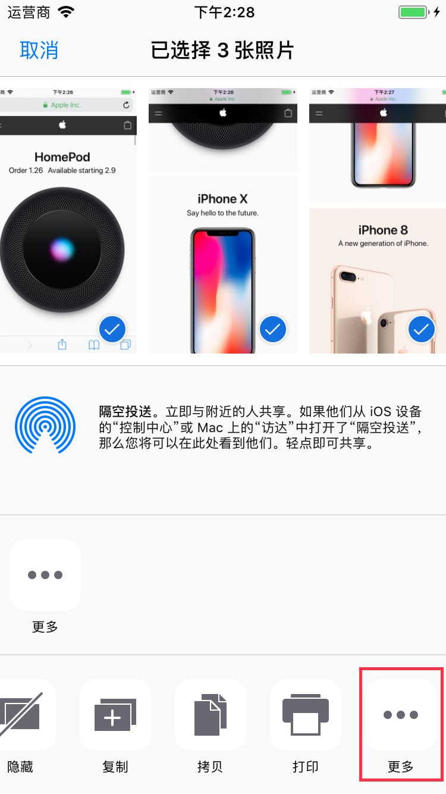
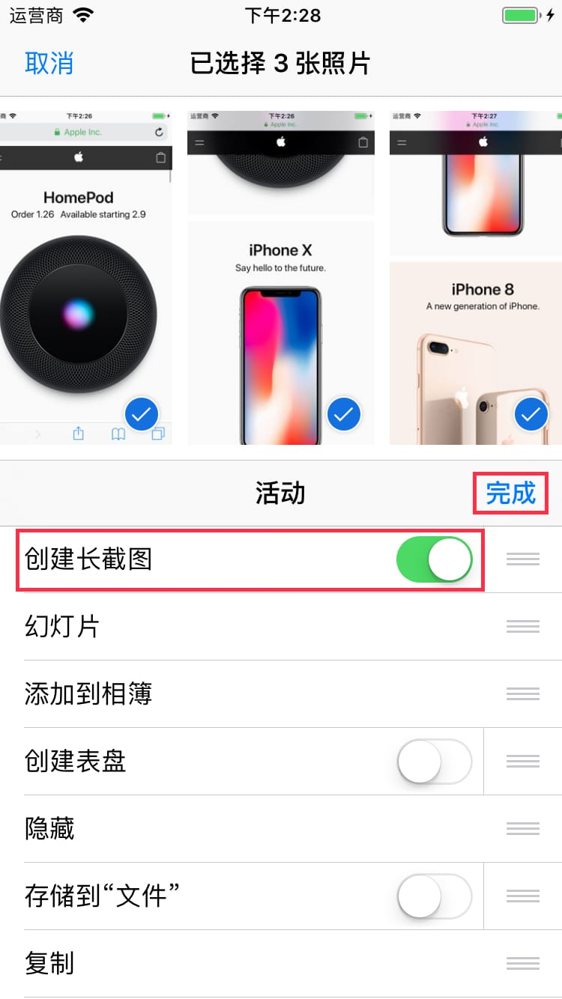
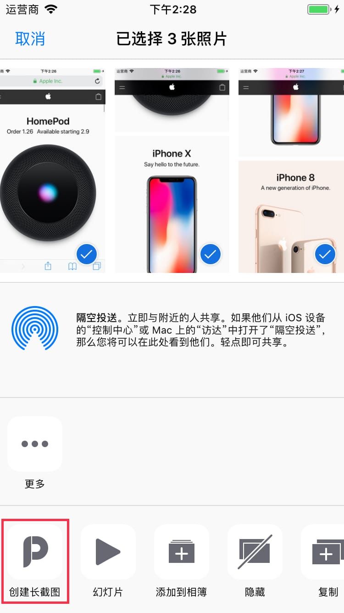

# 創建長截圖外掛程式

**創建長截圖** 外掛程式需要您在 **照片** 應用裏手動打開。

---

`1` 在分享面板的動作外掛程式欄最右側點擊 **更多** 按鈕。

---

`2` 在列表裏找到 **創建長截圖** 並且打開右側開關，然後點擊 **完成**。

---

`3` 點擊 **創建長截圖** 按鈕啟動外掛程式。

---

`4` 拼接成功後，點擊 **保存** 按鈕就可以保存長截圖了。

